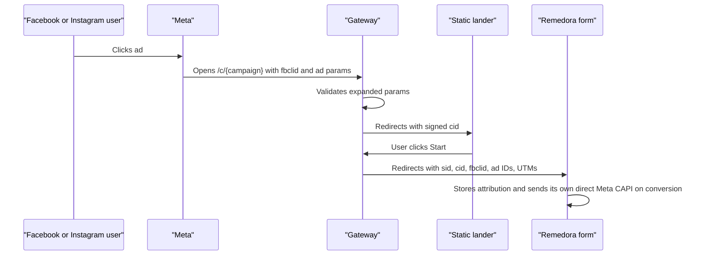

# Meta Attribution Gateway

PHP 8.2+ gateway for Remedora-style Meta ad funnels. It protects the downstream intake form URL from copied or Ad Library-stripped links while preserving the attribution params Remedora needs for its own direct Meta CAPI setup.

This app does **not** send CAPI events to Meta. Keep Remedora's built-in CAPI enabled and let Remedora send conversions directly.

## Gateway CAPI Removed

There is no gateway-side Meta CAPI setup anymore:

- No Meta pixel/dataset ID is required.
- No Meta access token is required.
- No intake webhook secret is required.
- No `/capi/intake-completed` integration is required.
- Remedora remains the conversion sender through its own direct Meta CAPI connection.

The gateway only protects routing and preserves attribution parameters until the visitor reaches Remedora.

## What It Does

- Gives Meta ads a first-party tracking URL like `/c/weight-intake`.
- Validates expanded Meta click params server-side.
- Sends copied, stripped, or unexpanded links to a public fallback page that keeps the same ad copy intact.
- Sends valid ad clicks to a static lander with a signed `cid`.
- Sends lander CTA clicks through `/start`, then redirects to Remedora with `sid`, `cid`, `gateway_cid`, `fbclid`, ad IDs, and UTMs preserved.
- Provides a first-run admin setup, domain portal, and campaign editor.

## Flow



## One-Click Deploy To Render

[](https://render.com/deploy?repo=https://github.com/coygg/meta-capi-gateway)

Render uses `render.yaml` to create:

- A Docker web service.
- A persistent SQLite disk at `/var/data`.
- A generated `APP_SECRET`.
- `DB_PATH=/var/data/gateway.sqlite`.
- `TRUST_PROXY=true` and secure cookies.

No Meta pixel/dataset ID, Meta access token, webhook secret, or CAPI dry-run setting is required.

After deploy:

1. Open the Render URL.
2. Go to `/admin`.
3. Create the first admin password.
4. Follow the quick setup walkthrough shown at the top of the admin dashboard.
5. Add a tracking domain, such as `track.yourdomain.com`.
6. Point DNS at the portal's displayed target.
7. Click **Verify** in the domain table.
8. Create or edit a campaign.
9. Set the static lander URL, Remedora form URL, and public fallback URL.
10. Copy the generated Meta ad URL from the admin dashboard into the Meta ad destination URL.
11. Keep Remedora direct CAPI enabled. Do not configure a Remedora webhook back to this gateway.

## Runway Or Wizard Deploys

If your deploy platform provides a wizard, it can prefill almost everything from the blueprint:

- Generate `APP_SECRET`.
- Create a persistent disk or persistent SQLite volume.
- Set `DB_PATH` to that persistent location.
- Set `APP_BASE_URL` or let the platform provide its external URL.
- Set `TRUST_PROXY=true` when the app is behind a load balancer.
- Optionally set `GATEWAY_CNAME_TARGET` if the platform has a fixed CNAME target.

The wizard does not need to ask users for Meta credentials. Domains and campaigns are configured later in `/admin`.

## HTTPS / SSL

Render and most one-click platforms terminate HTTPS for you. For self-hosting, the easiest HTTPS setup is the included Caddy reverse proxy. Caddy automatically requests and renews Let's Encrypt certificates.

Requirements:

- A public server with Docker Compose.
- DNS for `track.yourdomain.com` pointing to that server.
- Ports `80` and `443` open to the internet.

Self-host with automatic HTTPS:

```bash
cp .env.example .env
```

Edit `.env`:

```env
APP_ENV=production
APP_SECRET=<at least 32 random characters>
GATEWAY_DOMAIN=track.yourdomain.com
COOKIE_SECURE=true
TRUST_PROXY=true
```

Start the app and HTTPS proxy:

```bash
docker compose -f docker-compose.https.yml up -d --build
```

Then open:

```text
https://track.yourdomain.com/admin
```

Caddy stores certificates in the `caddy-data` Docker volume and SQLite data in the `gateway-data` Docker volume.

## Local Manual Setup

Use this for local development without HTTPS:

```bash
composer install
cp .env.example .env # optional if you create one
composer serve
```

Minimum production-style environment when not using the HTTPS compose file:

```env
APP_ENV=production
APP_BASE_URL=https://track.yourdomain.com
APP_SECRET=<at least 32 random characters>
DB_PATH=storage/gateway.sqlite
COOKIE_SECURE=true
TRUST_PROXY=true
GATEWAY_CNAME_TARGET=
```

Optional:

```env
CAMPAIGN_CONFIG_PATH=config/campaigns.php
```

## Campaign Logic

Meta ad URL:

```text
https://track.yourdomain.com/c/weight-intake?ad_id={{ad.id}}&adset_id={{adset.id}}&campaign_id={{campaign.id}}&utm_source=facebook&utm_medium=paid_social&utm_campaign={{campaign.name}}&utm_content={{ad.name}}
```

Valid clicks are redirected to the campaign lander with a signed `cid`.

The lander CTA should point to:

```text
https://track.yourdomain.com/start?cid=<cid from lander URL>
```

`/start` redirects to the Remedora form URL with:

- `sid`
- `cid`
- `gateway_cid`
- `fbclid`
- `ad_id`
- `adset_id`
- `campaign_id`
- `utm_source`
- `utm_medium`
- `utm_campaign`
- `utm_content`
- `utm_term` when present

Remedora receives those query params, stores its own attribution context, and sends CAPI directly to Meta when the intake converts.

## DNS

Add the tracking hostname in `/admin`, then create the matching DNS record with your DNS provider.

For Render or another managed platform, use the platform's custom-domain instructions. This is usually a CNAME:

```text
track.yourdomain.com CNAME your-render-or-platform-target
```

For the self-hosted Caddy setup, point the gateway hostname directly at the server:

```text
track.yourdomain.com A 203.0.113.10
track.yourdomain.com AAAA 2001:db8::10
```

Use `AAAA` only when your server has IPv6. The admin portal shows the expected DNS target and has a **Verify** action. Once verified, generated ad URLs use the active tracking domain automatically.

## Tests

```bash
composer test
composer test:coverage
```

The E2E test simulates:

- first-run admin setup
- first-run dashboard walkthrough and dismissal
- domain portal actions
- campaign creation and editing
- a valid Meta ad click
- a static lander handoff
- Remedora-style query capture
- copied or unexpanded links going to fallback
- removed gateway CAPI webhook returning 404
- rate limiting

## Notes

- Keep fallback copy aligned with the Facebook ad copy.
- Put the real Remedora form URL only in the protected campaign config.
- Do not send PHI through this gateway.
- Rotate `APP_SECRET` only if you are comfortable invalidating outstanding signed `cid` and `sid` tokens.
- This app is a routing and attribution-preservation gateway. Remedora remains the system that sends conversion events to Meta.
